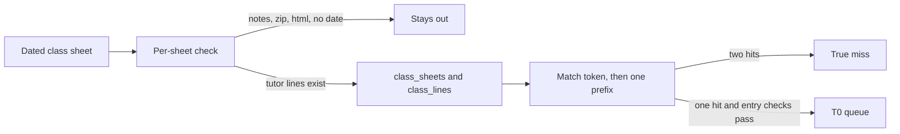
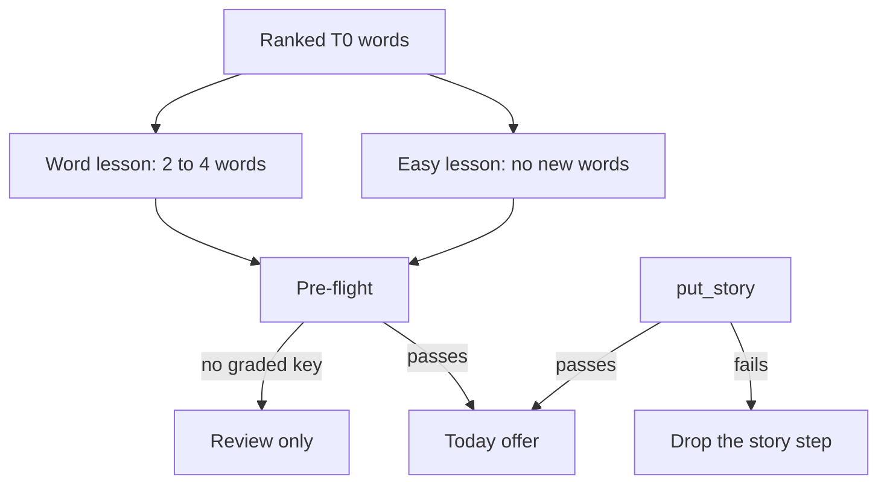
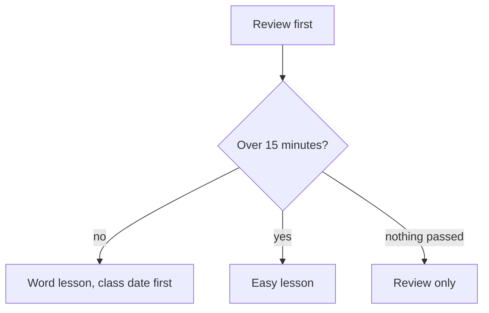
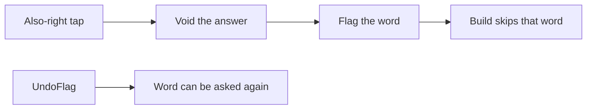

# INIT-039 diagrams

How a class becomes a lesson. Nothing here is a production deploy.

## Class load and the queue

```mermaid
flowchart LR
  sheet[Dated class sheet] --> check[Per-sheet check]
  check -->|notes, zip, html, no date| heldOut[Stays out]
  check -->|tutor lines exist| store[class_sheets and class_lines]
  store --> match[Match token, then one prefix]
  match -->|two hits| miss[True miss]
  match -->|one hit and entry checks pass| t0[T0 queue]
```

## Assemble, freeze, and the story

```mermaid
flowchart TD
  pool[Ranked T0 words] --> word[Word lesson: 2 to 4 words]
  pool --> easy[Easy lesson: no new words]
  word --> pre[Pre-flight]
  easy --> pre
  pre -->|no graded key| none[Review only]
  pre -->|passes| today[Today offer]
  story[put_story] -->|fails| drop[Drop the story step]
  story -->|passes| today
```

## Today

```mermaid
flowchart TD
  review[Review first] --> cap{Over 15 minutes?}
  cap -->|no| word[Word lesson, class date first]
  cap -->|yes| easy[Easy lesson]
  cap -->|nothing passed| only[Review only]
```

## Flag

```mermaid
flowchart LR
  tap[Also-right tap] --> void[Void the answer]
  void --> flag[Flag the word]
  flag --> skip[Build skips that word]
  undo[UndoFlag] --> back[Word can be asked again]
```
